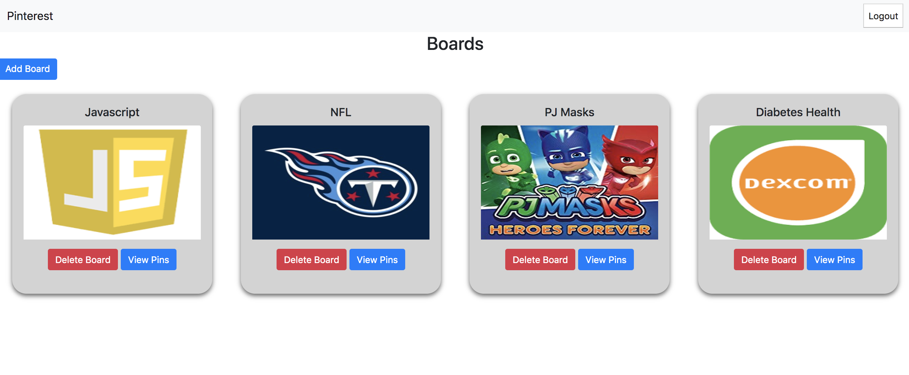

# Pinterest
Description 
------
This application is a low MVP of the social media sharing Pinterest website/app. A user can add or delete a board as well as update what board a pin belongs too.

## Screen Shots

## How to Run:
  * Clone this project from Github:
  * Install [http-server] (https://www.npmjs.com/package/http-server) from npm
  * At the root of this project run the following command: `hs -p 8888`
  * In your browser navigate to `https://localhost:8888`
